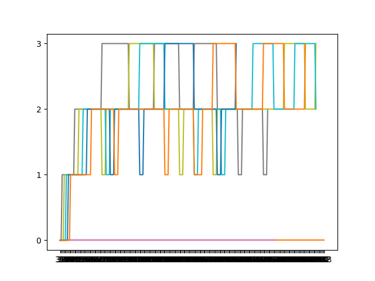

# Intro to Xv6
OSN Monsoon 2023 mini project 2

## Some pointers
- main xv6 source code is present inside `initial_xv6/src` directory. This is where you will be making all the additions/modifications necessary for the first 3 specifications. 
- work inside the `networks/` directory for the Specification 4 as mentioned in the assignment.
- Instructions to test the xv6 implementations are given in the `initial_xv6/README.md` file. 

- You are free to delete these instructions and add your report before submitting. 

# RUNTIME ANALYSIS
Using single CPU and MLFQ: Average rtime 25,  wtime 189

Using single CPU and FCFS: Average rtime 25,  wtime 152

Using single CPU and RR: Average rtime 25,  wtime 201

# Graph of processes running in MLFQ

Every time a process changed queues was tracked and plotted using python. Wait threshold set to 20 ticks.

# REPORT
## Implementations:
### FCFS: 
Iterate throught the process table, find the process with the minimum creation time, and run. Locks of the processes must be acquired and released appropriately.

### MLFQ:
In this implementation, 4 queues are used, one for each priority level. Add priority and starttime attributes to the process struct. Initialize priority to 0 in allocproc.

Loop through the process list. If the process is not present in any of the queues, insert it into the queue corresponding to its priority level. If it is present, check how long it has been waiting by taking the difference of starttime with current ticks. If greater than threshold, boost priority(aging).

Pick the first process in the highest priority queue and run it. If it uses more than the time slice allotted, decrease its priority and enqueue in the respective queue(unless it is already at min priority). If it does not, enqueue without changing priority. Each enqueue is accompanied by an update of the stattime of the process.

Loop continues, continuously checking process list for aging.