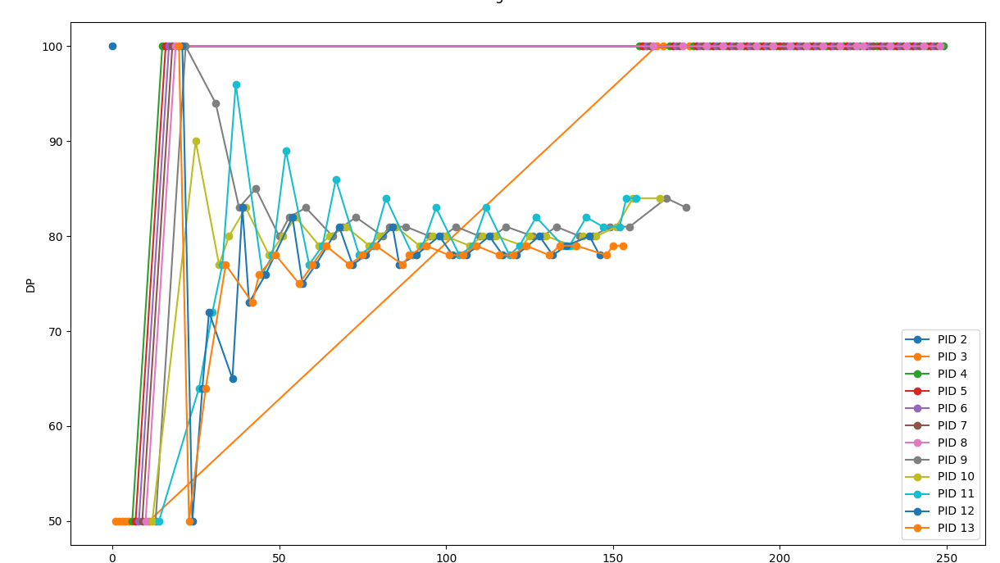

# OSN Monsoon 2023 mini project 3
## xv6 revisited and concurrency

*when will the pain and suffering end?*

## Some pointers/instructions

- Answer all the theoretical/analysis-based questions (for PBS scheduler and the concurrency questions) in a single `md `file.
- You may delete these instructions and add your report before submitting. 

# SCHEDULER AND COW
## ASSUMPTIONS: PBS Scheduler
- the wtime of the process is the total time spent in the ready queue since it was created and not since last scheduled.
- the rtime of the process is the preexisting rtime attribute of the proc part of the process struct in proc.h

## PBS Graph:

The graph is the DP of the process plotted against time. Dynamic Priority changes as per given formula involving rtime, wtime and stime.

# CONCURRENCY
## Assumptions: Cafe Sim
- simulation should run in real time
- free baristas prioritize customers based on their indices
- threads running concurrently may print interchangeably(events that take place at the same second for threads 1 and 2 may print in any order)

## Implementation Details:

### Main:
- each customer is a thread created in main.
- baristas represented as an array of semaphores. 
- customers are only allowed to get a barista if the customer with a smaller index was allotted a barista
- while loop keeps track of time and checks if coffees are done.
- when all coffees are prepared, loop breaks.
- pthread_join to ensure all threads are done.
- calculate average wait times of customers and print.
- print wasted coffees.
- destroy sems, free memory.

### Customer Thread:
- customer thread waits until the timer reaches its arrival time, then places order.
- customer attempts to find an available barista. Does sem_trywait in a loop until it gets a barista lock, then breaks.
- waittime stored(diff of global timer from before the barista finding loop and after).
- waits a second before barista starts preparing order.
- if its currently the second after the customers tol time is up, barista is releived and order is discarded(coffee not wasted)
- waits until coffee is prepared. if not yet prepared and tolerance time passed, customer leaves, a coffee is wasted, and barista continues preparing order.
- if customer hasnt left, they leave with order, and sem_post the barista that they occupied.

## Question 1
- Wait time of the customers will go down to zero(excluding time taken to prepare their coffee) if there is one barista for each customer. 
- Average wait time is also printed. Depends on number of available baristas. 
- With a limited barista count, if the customers with the lower indices order coffees that take a long time to prepare, the average wait time increases as the customers with the higher indices will be waiting on the baristas to finish preparing those orders first.

## Question 2
- Coffee wastage printed after simulation. This occurs when the customer leaves without his/her coffee due to it taking longer than their tol time.